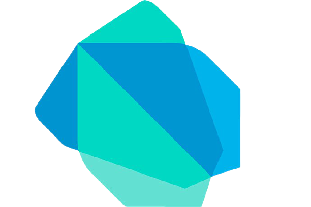

# Hi there.!👋 I'm Naman😎...

### 📍 _Chennai, India._

 

## I'm a Student🧑🏻, Learner📝, UI/UX Designer and Developer💡!!

 

- 🔭 _Currently working on a Flutter App._
- 🌐 _I am a Web Developer(Frontend)._
- 🌱 _I’m currently learning everything.!_ 🤣
- 👯 _I’m looking to collaborate with other developers._ 😀

 

## My Toolbox includes:

  
### Learning : 

 
 

## GitHub Stats :

 

 

